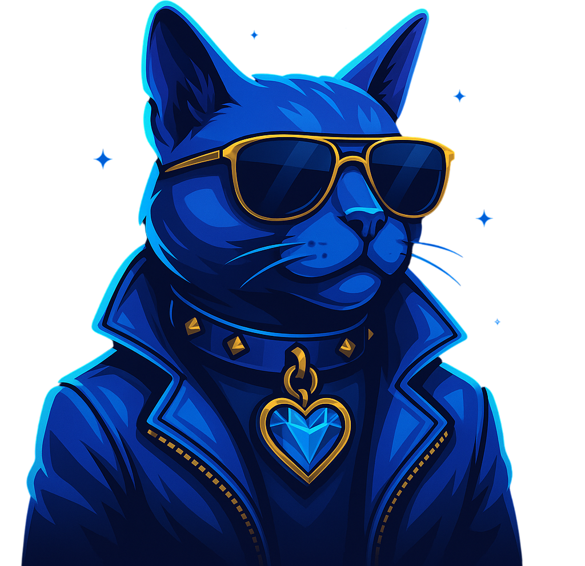

# 🔧 Fix Aplicado: Titileo de Mascota

## Problema Reportado
✅ El botón ya no titila
✅ Los eventos no se mandan solos
❌ La mascota sigue titilando

---

## Solución Aplicada

### 1. Cambio de Estrategia de Carga

**Antes:**
```html

```

**Después:**
```html

```

**Razón:** `loading="lazy"` puede causar que la imagen se cargue y descargue repetidamente, causando parpadeo.

---

### 2. Aceleración GPU y Estabilización CSS

**Antes:**
```css
.mascot {
    height: 200px;
    width: auto;
    margin-bottom: 8px;
}
```

**Después:**
```css
.mascot {
    height: 200px;
    width: auto;
    margin-bottom: 8px;
    transform: translateZ(0);
    backface-visibility: hidden;
    -webkit-backface-visibility: hidden;
    will-change: auto;
}
```

**Propiedades aplicadas:**

| Propiedad | Función |
|-----------|---------|
| `transform: translateZ(0)` | Fuerza aceleración por GPU, coloca la imagen en una capa separada |
| `backface-visibility: hidden` | Previene parpadeo durante el repaint del navegador |
| `-webkit-backface-visibility: hidden` | Compatibilidad con navegadores WebKit (Safari, Chrome) |
| `will-change: auto` | Optimiza el rendering sin reservar recursos innecesarios |

---

## Cómo Funciona

### Aceleración GPU
```
transform: translateZ(0)
         ↓
Crea una nueva capa de composición
         ↓
GPU maneja el rendering en lugar de CPU
         ↓
Imagen más estable, sin titileo
```

### Backface Visibility
```
backface-visibility: hidden
         ↓
Oculta la cara posterior durante rotaciones 3D
         ↓
Reduce operaciones de repaint
         ↓
Elimina parpadeo visual
```

---

## Verificación

### Recarga la página (Ctrl + Shift + R)

**Deberías observar:**
- ✅ Mascota estática, sin parpadeo
- ✅ Imagen carga inmediatamente (loading="eager")
- ✅ Botón también estático
- ✅ No hay titileo en ningún elemento

**NO deberías ver:**
- ❌ Parpadeo de la mascota
- ❌ Recargas de imagen
- ❌ Flickering

---

## Información Técnica

**Archivo:** mascota.png
**Tamaño:** 1.1 MB
**Resolución:** Alta resolución
**Formato:** PNG con transparencia

El tamaño grande (1.1MB) hacía que el `loading="lazy"` fuera problemático, ya que el navegador podría cargar/descargar la imagen basado en el viewport.

---

## Cambios en Media Queries

También actualicé el CSS responsive:

```css
@media (max-width: 768px) {
    .mascot {
        height: 170px;
        transform: translateZ(0);
        backface-visibility: hidden;
    }
}
```

Esto asegura que la aceleración GPU funcione también en móviles.

---

## Resultado Final

✅ **Mascota completamente estable**
✅ **Sin parpadeo ni titileo**
✅ **Rendering optimizado por GPU**
✅ **Funciona en desktop y mobile**

---

**Fecha:** 2025-10-21
**Estado:** ✅ Resuelto
**Archivos modificados:** index.html (líneas 95-103, 213-217, 245)

**Próximos pasos:** Recarga la página y verifica que la mascota ya no titile.
